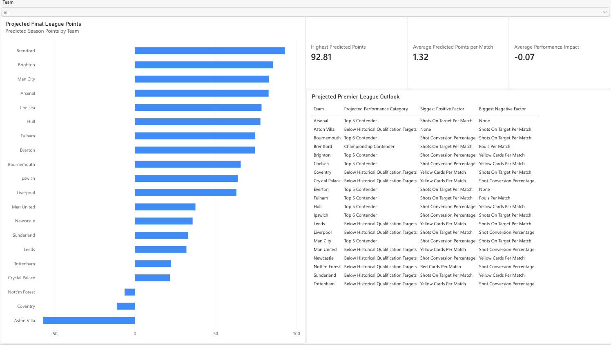

# Premier League Performance Dashboard



## Project Overview

This project analyses Premier League team performance and uses historical data and machine learning to estimate team success based on key performance metrics.

The project compares current team performance against historical performance baselines and estimates predicted points per match and predicted season points. The results are presented in a Power BI dashboard.

## Research Question

Which team performance metrics are most associated with Premier League success, and how can current-season performance be used to predict future league outcomes?

## Technologies Used

- Python
- Pandas
- NumPy
- Scikit-learn
- Matplotlib
- Power BI
- Git and GitHub

## Project Structure

```text
data/
├── raw/
└── processed/

src/
├── 01_data_cleaning.py
├── 02_exploratory_analysis.py
├── 03_model_development.py
└── 04_current_season_analysis.py

.gitignore
requirements.txt
README.md